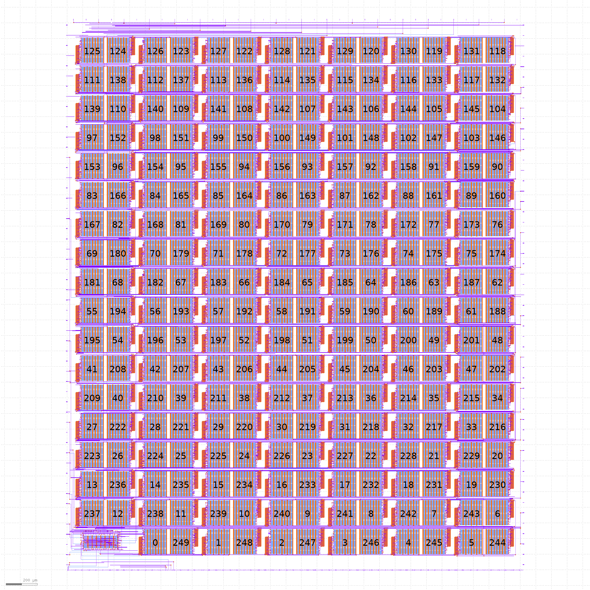

# TinyTapeout 03

* Visit https://tinytapeout.com for more information on the project and how to get involved.
* Read [INFO](INFO.md) for how the project is built and technical project notes.
* Read [Verification](VERIFICATION.md) for how we verify the project.

# Datasheet

[PDF Download](datasheet.pdf).

For the most recent automatic build, click the tt_datasheet badge above, then download the PDF artifact.

# GDS layout of all projects

# Project Index

| Index | Author | Title | Type | Git Repo |
| ----- | ------ | ------| -----| ---------|
| 0 | Matt Venn | Test Inverter Project | [Wokwi](https://wokwi.com/projects/361728533238569985) | https://github.com/TinyTapeout/tt03-test-invert |
| 1 | Joao Pedro Pedrosa | a and c or b | [Wokwi](https://wokwi.com/projects/361088881055404033) | https://github.com/pedrosajp/a-and-c-or-b |
| 2 | Carter Clay | A AND B OR C | [Wokwi](https://wokwi.com/projects/361088812700822529) | https://github.com/carterclay2/A-OR-B-AND-C |
| 3 | ImmanuelZL | B and C or A  | [Wokwi](https://wokwi.com/projects/361088803642172417) | https://github.com/ImmanuelZL/B-and-C-or-A |
| 4 | Charlize Hill | A+!B+C | [Wokwi](https://wokwi.com/projects/359117498298719233) | https://github.com/CharlizeH/Tiny-Tapeout-A-OR-NOT-B-OR-C |
| 5 | Dino Danovic | A xor b and c | [Wokwi](https://wokwi.com/projects/361721071853260801) | https://github.com/dinobambino1/A-xor-B-and-C |
| 6 | Jermaine | Tiny tapeout | [Wokwi](https://wokwi.com/projects/363170982149101569) | https://github.com/JermaineRM/jermaines-fork |
| 7 | daniel joseph | tiny tape out not a and not b | [Wokwi](https://wokwi.com/projects/363170940975709185) | https://github.com/DanieljosC/not-a-and-not-b- |
| 8 | Jesse Mugisha | Tiny Tapeout 3 Template Jesse | [Wokwi](https://wokwi.com/projects/362989425382889473) | https://github.com/RCAstudent10/A-not-B-and-C |
| 9 | Laura Holmes | Not A Or B | [Wokwi](https://wokwi.com/projects/361088738149159937) | https://github.com/ldholmes2000/Not-A-Or-B |
| 10 | Dan Fiumara | Simple Elevator Circuit | [Wokwi](https://wokwi.com/projects/356598821615835137) | https://github.com/fiumad/Tiny-Tapeout-Simple-Elevator |
| 11 | Redemption Christian Academy | Traffic Light Circuit | [Wokwi](https://wokwi.com/projects/363176375876859905) | https://github.com/fiumad/RCA-Traffic-Light |
| 12 | Redemption Christian Academy | 4 Bit Lock Circuit | [Wokwi](https://wokwi.com/projects/364627602320567297) | https://github.com/fiumad/RCA-Lock-Circuit |
